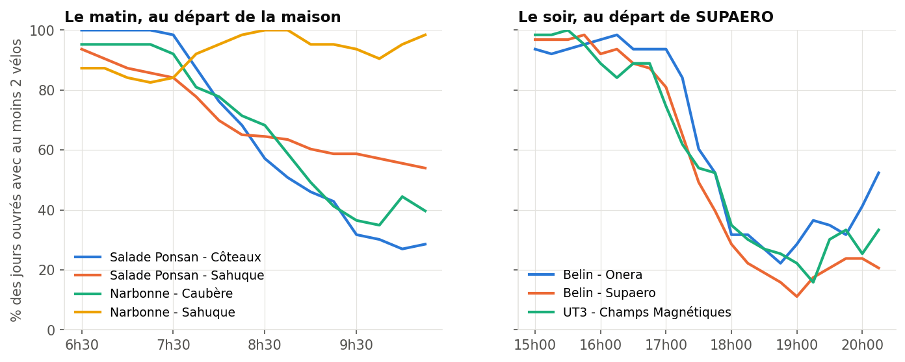
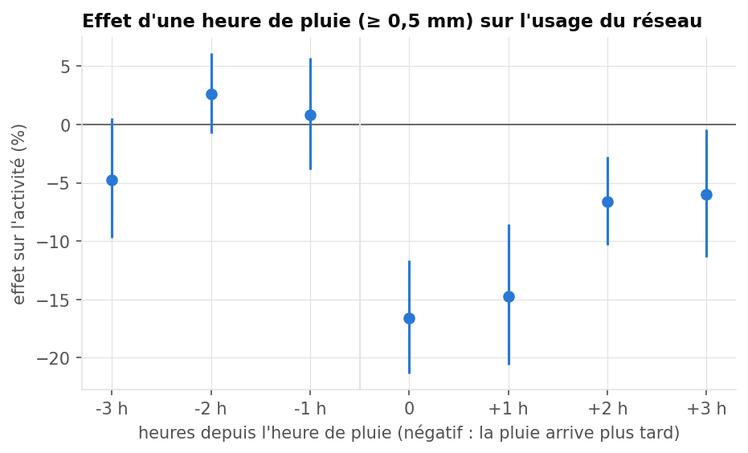

# Vais-je trouver un vélo ?

Je fais le trajet Salade Ponsan → ISAE-SUPAERO en VélôToulouse et la station est souvent vide
quand j'arrive. Du coup j'ai relevé l'état de tout le réseau toutes les 15 minutes pendant trois
mois (sept à nov 2024, 383 stations) avec un [collecteur sur un Raspberry Pi](https://github.com/batistefnl/velotoulouse-collecteur),
pour voir quand partir, si on peut prédire qu'il restera un vélo, et au passage l'effet de la pluie.

## Ce que ça donne

**Quand partir.** Le matin à Salade Ponsan - Côteaux il y a au moins 2 vélos tous les jours
ouvrés jusqu'à 7h15 (98 % à 7h30), mais plus que 57 % à 8h30. Après 7h45 vaut mieux aller à
Narbonne - Sahuque, 120 m plus loin, qui se remplit le matin (au moins 90 % jusqu'à 10h15).
Le soir il faut partir de SUPAERO avant 17h : on passe de 75-94 % à 17h à 29-35 % à 18h.



Je regarde la proba d'avoir au moins 2 vélos (un vélo seul c'est souvent un vélo cassé) plutôt
que le nombre moyen, parce qu'une moyenne de 3 vélos ça peut vouloir dire 49 % comme 76 % du
temps avec 2 vélos selon la station.

**Prédire.** Un gradient boosting qui prédit P(≥ 2 vélos dans 15, 30 ou 60 min) à partir de
l'état de la station, de l'heure, du calendrier et de la météo. Entraîné sur sept-oct, testé
sur novembre. Score de Brier à 30 min sur mes 7 stations (plus bas = mieux) :

| modèle | Brier |
|---|---|
| profil horaire (que l'heure) | 0,179 |
| persistance (que l'état actuel) | 0,098 |
| régression logistique | 0,097 |
| gradient boosting | 0,092 |

En gros l'état actuel de la station fait presque tout, l'heure seule prédit mal. Le gradient
boosting gagne 4,6 % à 7 % sur la persistance selon l'horizon, un peu plus dans les cas serrés
(1 à 4 vélos), et il est bien calibré. J'avais aussi mis la tendance sur 15 et 60 min mais ça
apportait presque rien, je l'ai enlevée pour que l'app n'ait besoin que du flux temps réel.

**La pluie.** J'estime l'effet d'une heure de pluie (≥ 0,5 mm) sur l'activité du réseau avec des
effets fixes par date et par heure, donc en comparant les heures de pluie aux heures sèches du
même jour. Ça donne -17 % pendant l'heure où il pleut et encore -15 % l'heure d'après. La pluie
qui arrive dans les heures suivantes n'a pas d'effet, ce qui sert de test placebo.



Bon ça reste 20 jours de pluie et une seule station météo (Blagnac, à 10 km du campus), donc les
intervalles sont larges. Et c'est l'usage du réseau, pas la dispo à mes stations.

## Lancer

Il faut [uv](https://docs.astral.sh/uv/) et les fichiers du collecteur dans `data/raw/`.

```bash
uv sync
cp ../velotoulouse-collecteur/data/collected_*.parquet data/raw/
make data      # grille de 15 min, < 1 min
make model     # ~4 min
make figures
make rain      # estimations pluie
make test
```

La météo (Météo-France) et les calendriers (vacances, fériés) sont téléchargés tout seuls la
première fois.

Il y a aussi une petite app Streamlit (`make app`) qui prend le flux temps réel et la météo
d'Open-Meteo et dit à quelle station aller pour mon trajet. Marche sur mon Mac, pas testé
ailleurs.

## À faire

- les vélos hors service et méca/électrique, le collecteur ne les garde pas
- prédire les places libres à l'arrivée, pour l'instant l'app affiche juste l'état actuel
- le modèle a vu qu'un automne, pas d'été ni de vacances de Noël
- regarder le rééquilibrage par camion

Données : flux GBFS VélôToulouse (ODbL), Météo-France (Licence Ouverte Etalab 2.0).
